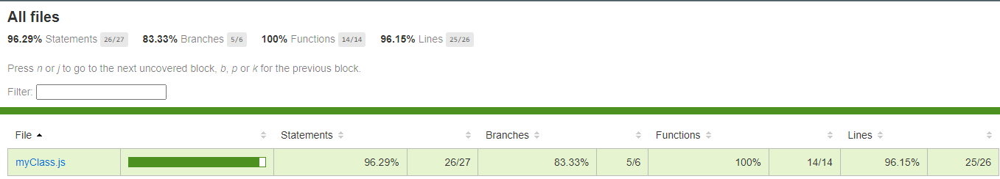
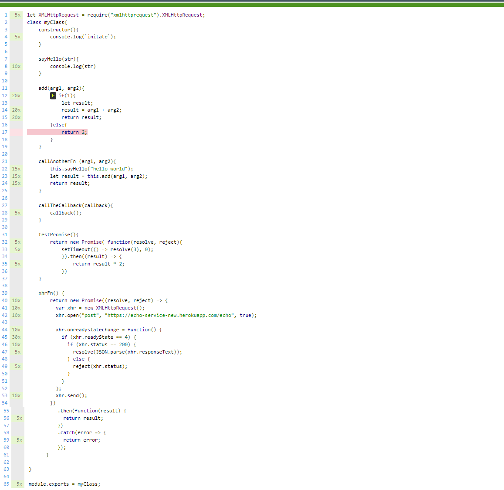

# Mocha - Javascript unit testing framework

- o sistema esta esperando que o resultado pela soma dos arg1 + arg2 seja igual a 3
- `expect(myObj.add(1, 2)).to.be.equal(3);`

- afirma a ligação da variável "spy" uma vez
- `sinon.assert.calledOnce(spy);`

- espera que a ligação da variável "spy" uma vez é verdade
- `expect(spy.calledOnce).to.be.true;`

- espera que a ligação da variável "spy" com os paramentros informados é verdadeiro
- `expect(spy.calledWith(arg1, arg2)).to.be.true;`

<h1 align="center">💻 Desenvolvido Por: Gilberto Júnior</h1>
